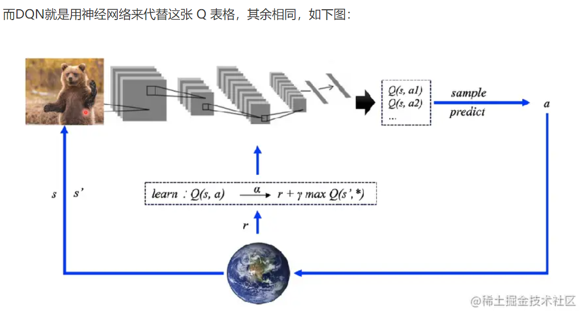

# 强化学习玩玛丽奥

## OpenAI Gym
>  OpenAI Gym是一个研究和比较强化学习相关算法的开源工具包，包含了许多经典的仿真环境和各种数据。


### 超级马里奥模拟器
项目地址： https://github.com/Kautenja/gym-super-mario-bros


##  Q-Learning 算法

Q-Learning是强化学习算法中value-based的算法，Q即为Q（s，a），就是在某一个时刻的state状态下，采取动作a能够获得收益的期望，环境会根据agent的动作反馈相应的reward奖赏，所以算法的主要思想就是将state和action构建成一张Q_table表来存储Q值，然后根据Q值来选取能够获得最大收益的动作。

Q-learning的主要优势就是使用了时间差分法（融合了蒙特卡洛和动态规划）能够进行off-policy的学习，使用贝尔曼方程可以对马尔科夫过程求解最优策略。

比如下面这个例子


假设我们的行为准侧已经学习好了，现在我们处于状态s1,我在写作业，我有两个行为a1,a2,分别是看电视和写作业，根据我的经验（Q-table）知道，在s1的状态下，我选择a2写作业带来的reward奖赏比a1看电视高，在我的Q-table中，Q(s1,a1)=-2要小于Q（s1，a2）=1，所以我们判断要选择a2写作业作为我们的下一个行为。

现在我们的状态更新成s2，我们还是有两个同样的选择，重复上面的过程，在行为准则Q-table中寻找Q(s2,a1)Q(s2,s2)的值，并比较他们的大小，选取较大的一个。接着根据a2我们到达s3并重复上述的决策过程，Q-learning的方法就是这样抉择的。


根据Q表的估计，因为在s1中，a2的值比较大，通过之前的决策方法我们在s1选择了a2，并到达s2，这时我们开始更新用于决策的Q表，接着我们并没有在实际中采取任何行为，而是在想象自己在s2上采取了a1,a2两个行为，分别看看两种行为哪一个的Q值大，比如说Q(s2,a2)的值比Q(s2,a1)的大，所以我们把大的Q（s2,a2）乘上一个衰减值gamma(eg 0.9)并加上到达s2时所获得的奖励Reward（这里没有获取到我们的棒棒糖，所以奖励为0），因为会获取实实在在的奖励Reward，所以我们将这个作为我们现实中Q（s1,a2）的值，但是我们之前是根据Q表估计Q(s1,a2)的值。所以有了现实值和估计值，我们就可以更新Q(s1,a2)的值，变成新的值。但时刻记住，我们虽然用maxQ(s2)估算了一下s2的状态，但还没有在S2做出任何行为，s2的行为决策要等到更新完了以后再重新另外做，这就是off-policy的Q-learning是如何决策和学习优化决策过程。

### 算法公式


这一张图概括了我们之前所有的内容。这也就是Q-learning算法，每次更新我们都用到了Q现实和Q估计，而且Q-learning迷人之处就是在Q(s1,a2)的现实中，包含了一个 Q（s2）的最大估计值，将对下一步衰减的最大估计和当前所得到的奖励作为这一步的现实。

参数介绍
- Epsilon greedy：是用在决策上的一个策略，比如epsilon = 0.9的时候，就说明百分之90的情况我会按照Q表的最优值选择行为，百分之10的时间随机选择行为。
- alpha：学习率，决定这次的误差有多少是要被学习的。
- gamma：对未来reward的衰减值。gamma越接近1，机器对未来的reward越敏感

## DQN 算法原理

> DQN算法 = Q-Learning 算法 + 神经网络




对应项目的更新代码为
```python
def compute_td_loss(model, target_net, replay_buffer, gamma, device,
                    batch_size, beta):
    batch = replay_buffer.sample(batch_size, beta)
    state, action, reward, next_state, done, indices, weights = batch

    state = Variable(FloatTensor(np.float32(state))).to(device)
    next_state = Variable(FloatTensor(np.float32(next_state))).to(device)
    action = Variable(LongTensor(action)).to(device)
    reward = Variable(FloatTensor(reward)).to(device)
    done = Variable(FloatTensor(done)).to(device)
    weights = Variable(FloatTensor(weights)).to(device)

    q_values = model(state)
    next_q_values = target_net(next_state)

    q_value = q_values.gather(1, action.unsqueeze(-1)).squeeze(-1)
    next_q_value = next_q_values.max(1)[0]
    expected_q_value = reward + gamma * next_q_value * (1 - done)

    loss = (q_value - expected_q_value.detach()).pow(2) * weights
    prios = loss + 1e-5
    loss = loss.mean()
    loss.backward()
    replay_buffer.update_priorities(indices, prios.data.cpu().numpy())
```

### 经验回放
DQN 第一个特色是使用 Experience replay ，也就是经验回放，为何要用经验回放？还请看下文慢慢详述

对于网络输入，DQN 算法是把整个游戏的像素作为 神经网络的输入，具体网络结构如下图所示：


第一个问题就是样本相关度的问题，因为在强化学习过程中搜集的数据就是一个时序的玩游戏序列，游戏在像素级别其关联度是非常高的，可能只是在某一处特别小的区域像素有变化，其余像素都没有变化，所以不同时序之间的样本的关联度是非常高的，这样就会使得网络学习比较困难。


### Fixed Q targets


## 参考文档
- https://zhuanlan.zhihu.com/p/74225549
- https://juejin.cn/post/6859337535168970766